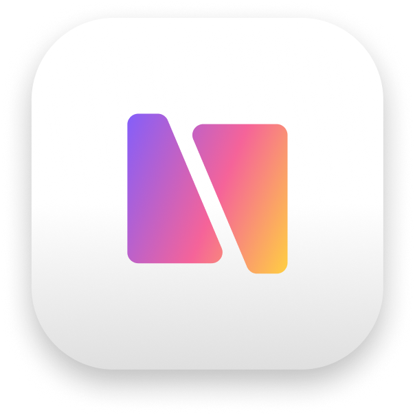

  

<h1 align="center">BetterStage</h1>

  <strong>Every window where it belongs.</strong>

  <a href="https://betterstage.app">Website</a> · <a href="https://github.com/terrytz/BetterStage/releases">Releases</a> · <a href="https://discord.gg/WXpH2MCvcn">Discord</a> · <a href="https://github.com/terrytz/BetterStage/discussions">Discussions</a> · <a href="https://github.com/terrytz/BetterStage/issues">Report a Bug</a>

---

## The Problem

You've got 20+ windows across 2-3 monitors. Four projects going at once. You're alt-tabbing through a graveyard of forgotten windows just to find the one you need.

macOS gives you two options:

**Spaces** — that 700ms sliding animation you can't disable. Every switch freezes your keyboard. Every. Single. Time.

**Stage Manager** — works per-display only, no keyboard shortcuts, wastes screen space on thumbnails, and tops out at 4 groups. Apple shipped it and moved on.

Neither gives you what you actually need: named workspaces that span all your monitors, switch instantly, and stay out of your way.

## What BetterStage Does

BetterStage gives you **9 named stages** — workspaces that span every connected monitor at once. Press `Opt+1` and your entire screen setup changes in under 16ms. No animation. No freeze. Just your windows, exactly where you left them.

### Stages

Your monitors are one workspace. "Frontend" on Stage 1, "Backend" on Stage 2, "Design" on Stage 3 — each with its own window layout across all screens. Switch with `Opt+1-9`, cycle with `Opt+Tab`, or scroll through with `Opt+Scroll`. Send any window to another stage with `Opt+Shift+1-9` without leaving your current context.

Windows survive reboots. Stages have names you choose. Click an app in the Dock and BetterStage auto-switches to the right stage.

### Snap Zones

Drag a window to the edge of your screen and pick from 14 snap zones — halves, thirds, quarters, and layouts that adapt to portrait monitors. Or skip the mouse entirely: keyboard shortcuts snap windows without lifting your hands.

### Bento Box Tiling

Toggle auto-tiling per stage and windows arrange themselves in a clean BSP grid. Open a new window and the layout adjusts. Close one and the others fill the gap. Drag to reorder with iOS-style expel/swap. A master window gets priority sizing while the rest stack alongside it.

### Snap Wheel

Hold `Ctrl+Opt` on a title bar or middle-click anywhere to open a radial menu — snap zones, stage assignment, and tiling actions in one gesture. Pick a zone and release.

### Multi-Monitor

Full support for 2, 3, or more displays. Portrait monitors get adapted snap zones. Pin a monitor to keep reference windows (Slack, docs, music) visible while other screens swap between stages. Exclude displays you don't want managed.

### Keyboard-First

Every action has a shortcut. Every shortcut is customizable with conflict detection. No config files, no scripting — just a preferences panel.

## How It Compares

| | BetterStage | Stage Manager | Spaces | yabai |
|---|---|---|---|---|
| Multi-monitor workspaces | All screens as one stage | Per-display only | Per-display only | Per-display only |
| Switch speed | <16ms, zero animation | Animated | 700ms freeze | Instant |
| Keyboard shortcuts | Full, customizable | None | Limited | Full (config file) |
| Named workspaces | Yes | No | No | No |
| Auto-tiling | BSP with drag reorder | No | No | Yes |
| Snap zones | 14 zones + radial wheel | No | No | No |
| Max workspaces | 9 | 4 | 16 | Unlimited |
| Setup required | Install and go | Built-in | Built-in | SIP disable + config |
| Permissions | Accessibility only | — | — | Accessibility + SIP |

## Technical Details

- 100% native Swift and AppKit — no Electron, no web views
- Under 10MB, less than 1% idle CPU
- No SIP disable required (unlike yabai and AeroSpace)
- Only needs Accessibility permission — no Input Monitoring, no Screen Recording
- No telemetry, no data collection, no network calls (except update checks and license validation)
- macOS 14 Sonoma or later

## Pricing

BetterStage has a free tier that's actually useful — 3 stages, all snap zones, and full keyboard shortcuts. That alone replaces Rectangle or Magnet.

**Pro** unlocks 9 stages, Bento Box tiling, Snap Wheel, and monitor pinning. $24.99 lifetime or $2.99/month. 10-day Pro trial included.

[Download from betterstage.app](https://betterstage.app) or grab the latest from [Releases](https://github.com/terrytz/BetterStage/releases).

## Community

- [Discord](https://discord.gg/WXpH2MCvcn) — chat, feedback, feature requests
- [Discussions](https://github.com/terrytz/BetterStage/discussions) — longer-form questions and ideas
- [Issues](https://github.com/terrytz/BetterStage/issues) — bug reports

## Security

Found a vulnerability? See [SECURITY.md](SECURITY.md).

## License

BetterStage is proprietary software. See [LICENSE](LICENSE).
