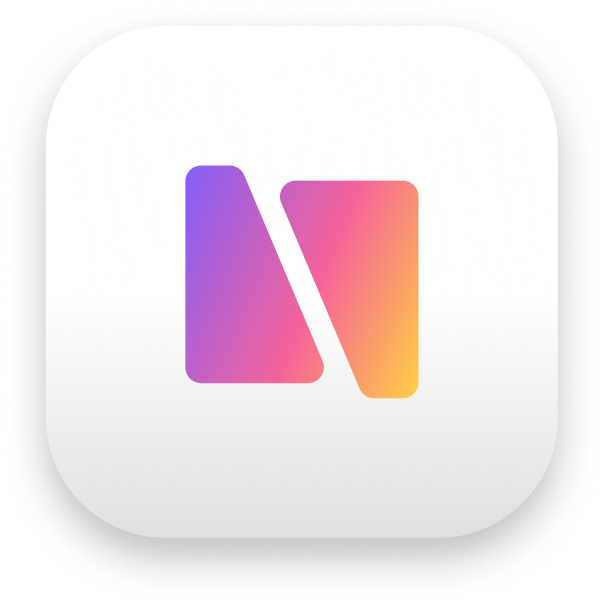

  

<h1 align="center">BetterStage</h1>

  <strong>Named multi-monitor workspaces, instant switching, tiling, tabs, snap zones, and AI Staging for macOS.</strong>

  <a href="https://betterstage.app">Website</a> ·
  <a href="https://betterstage.app/download/thanks">Download</a> ·
  <a href="https://betterstage.app/docs">Docs</a> ·
  <a href="CHANGELOG.md">Changelog</a> ·
  <a href="https://discord.gg/WXpH2MCvcn">Discord</a> ·
  <a href="https://github.com/terrytz/BetterStage/discussions">Discussions</a> ·
  <a href="https://github.com/terrytz/BetterStage/issues">Issues</a>

---

  <video src="https://github.com/user-attachments/assets/2e6d7d91-f1ba-4378-8070-7855646b6fbe" controls autoplay loop muted width="100%"></video>

## What BetterStage Does

BetterStage is a native macOS workspace manager. A stage is a named workspace that spans all of your monitors at once. Switch to a stage and every display changes together, without macOS Spaces animation or Stage Manager thumbnails.

BetterStage is built for people who keep many projects, apps, chats, terminals, browsers, documents, and monitors open all day.

## Core Features

- **Stages** - up to 9 named workspaces spanning every connected monitor. Switch with `Opt+1-9`, cycle with `Opt+Tab`, send windows with `Opt+Shift+1-9`, or drag a window to the Stages Bar.
- **Window Modes** - choose per monitor per stage: macOS Native, Bento Box, or Tabbed Layout Mode.
- **Bento Box** - automatic non-overlapping tiling with drag-to-resize, drop-to-swap, drop-on-edge insertion, pinning, gaps, padding, and retile.
- **Tabbed Layout Mode** - saved pane layouts where multiple windows can share a pane as tabs. Presets include Split View, Top / Bottom, Focus + Stack, Four Corners, and custom layouts.
- **Snap Zones** - 15 keyboard and drag zones for halves, thirds, two-thirds, quarters, and full-screen placement.
- **Snap Wheel** - a configurable radial menu for snap zones, Window Modes, stage actions, Retile, AI Staging, and more. Supports keyboard, mouse, modifier, and 4/5-finger trackpad triggers.
- **Pinned Displays** - keep selected monitors visible across all stages for chat, docs, music, dashboards, or reference windows.
- **Keyboard-first control** - customizable shortcuts, conflict warnings, Standard and European keyboard layout presets, directional focus, scoped `Cmd+\`` cycling, and a searchable shortcut settings view.
- **AI Staging** - describe the workspace you want in a floating chat panel. Mention apps, windows, stages, monitors, or Window Modes; review the proposed plan; refine it; apply; and undo the whole arrangement in one step.
- **Window Rules** - save standing AI Staging instructions, edit them with the same mention chips, and preview the exact prompt sent to the model.

## AI Staging

AI Staging is bring-your-own-provider. BetterStage sends a structured window snapshot directly from your Mac to the AI provider you configure; BetterStage servers do not receive the AI Staging prompt or response.

Current provider presets include OpenAI, Claude, Google Gemini, OpenRouter, Groq, Together AI, Mistral, xAI, DeepSeek, Moonshot/Kimi, Zhipu/GLM, Alibaba Qwen, MiniMax, Tencent Hunyuan, ByteDance Doubao, Xiaomi MiMo, StepFun, SiliconFlow, Novita AI, NVIDIA NIM, Hugging Face, Azure OpenAI, LM Studio, Ollama, Ollama Cloud, and Custom OpenAI-compatible endpoints.

The current public AI prompt files are in [`prompt-template/`](prompt-template/). They mirror the current app prompt shape: a short system message plus a dynamically rendered chat user prompt with workspace JSON, entity glossary, saved Window Rules, chat history, and action-envelope instructions.

## Pricing

Every download includes a 10-day Pro trial. If you do not upgrade, BetterStage falls back to the Free tier.

| Tier | Includes |
| --- | --- |
| Free | 3 stages, Snap Zones, Snap Wheel, keyboard shortcuts, multi-monitor support, 1 device |
| Pro | 9 stages, AI Staging, Bento Box, Tabbed Layout Mode, Pinned Displays, all future updates |

Pro is lifetime-only:

- Pro · 1 Device: `$19.99`
- Pro · 3 Devices: `$39.99`
- Pro · 5 Devices: `$49.99`

Launch pricing may increase. Current pricing lives at [betterstage.app/pricing](https://betterstage.app/pricing).

## Technical Details

- Native Swift 5.9 and AppKit app for macOS 14 Sonoma or later.
- Universal release build for Apple Silicon and Intel Macs.
- Distributed as a signed DMG; updates use Sparkle from `https://update.betterstage.app/appcast.xml`.
- Uses standard macOS Accessibility APIs. No SIP disable, Input Monitoring, or Screen Recording permission is required.
- No app telemetry or in-app usage analytics. Network access is used for update checks, license/account validation, optional onboarding media, optional model-list fetching, and optional AI Staging requests you configure.
- Source code is private; this public repository is the community hub, changelog, issue tracker, and prompt-transparency surface.

## Download

- [Download BetterStage](https://betterstage.app/download/thanks)
- [Direct DMG for v1.1.2](https://update.betterstage.app/BetterStage-1.1.2.dmg)
- [Release notes](CHANGELOG.md)

## Community

- [Discord](https://discord.gg/WXpH2MCvcn) - chat, feedback, support, and feature requests.
- [Discussions](https://github.com/terrytz/BetterStage/discussions) - longer-form questions and ideas.
- [Issues](https://github.com/terrytz/BetterStage/issues) - reproducible bugs and focused requests.

## Security

Found a vulnerability? See [SECURITY.md](SECURITY.md). Please do not open public issues for security vulnerabilities.

## License

BetterStage is proprietary software. See [LICENSE](LICENSE).
